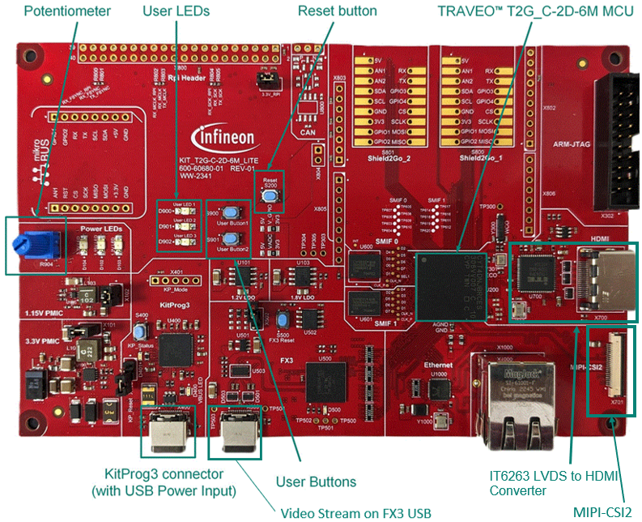

# MIPI-CSI2 Camera capture example for graphics middleware

**This code example is for outputting the display of a Camera image with graphics library package via MIPI-CSI2 of Graphic Subsystems.**  

The drivers used or available in this code example are listed below.
- [Graphics Driver for TRAVEO™ T2G cluster series user guide](https://myicp.infineon.com/sites/TRAVEODocumentation/Lists/defaultdoclib/Forms/AllItems.aspx?RootFolder=%2Fsites%2FTRAVEODocumentation%2FLists%2Fdefaultdoclib%2FTraveo%20II%2FTraveo%20II%20Cluster%2FGraphics&FolderCTID=0x01200023F2B2CA20D58647B6BFDE768454209B&View=%7BC8DBE6BD%2D4E7B%2D49A9%2D9267%2D2F926C13CB27%7D)
  - Chapter 4: Modules
  - Chapter 5: Classes
> **Note:** The above document are available on the myInfineon Collaboration Platform (MyICP). If not already available, please create a myInfineon account on [www.infineon.com](http://www.infineon.com/). Then, contact traveo@infineon.com and request access to TRAVEO™ T2G myICP.

- [JPEG decode driver user guide (TRAVEO™ T2G cluster series)](https://www.infineon.com/assets/row/public/documents/10/44/infineon-traveo-t2g-jpeg-decode-user-guide-usermanual-en.pdf?fileId=8ac78c8c8c3de074018c816028cf0ca8)
  - Chapter 2: JPEG decode driver

## Requirements

- [ModusToolbox&trade;](https://www.infineon.com/modustoolbox) v3.5.0 or later (tested with v3.5.0)

## Supported toolchains (make variable 'TOOLCHAIN')

- GNU Arm&reg; Embedded Compiler v11.3.1 (`GCC_ARM`) – Default value of `TOOLCHAIN`

## Device

Device used in this code example is:
- [TRAVEO&trade; T2G CYT4DN Series](https://www.infineon.com/cms/en/product/microcontroller/32-bit-traveo-t2g-arm-cortex-microcontroller/32-bit-traveo-t2g-arm-cortex-for-cluster/traveo-t2g-cyt4dn/)

## Board

Board used for testing is:
- TRAVEO&trade; T2G Cluster 6M Lite Kit ([KIT_T2G_C-2D-6M_LITE](https://www.infineon.com/cms/en/product/evaluation-boards/kit_t2g_c-2d-6m_lite/))

## Scope of work
This is a basic code example for outputting video via the MIPI-CSI2 camera on the TRAVEO&trade;  T2G Cluster 6M Lite kit to an HDMI display. See the [Hardware setup](#hardware-setup) for a MIPI-CSI2 interface.

## Introduction  

**Graphic Subsystems**
- Supports 2D and 2.5D (perspective warping, 3D effects) graphics rendering
- 40-bit for internal processing (RGBA 10-bit per color channel)
- 24-bit for interfaces (RGB 8-bit per color channel)
- 4096 KB of embedded video RAM memory (VRAM)
- Up to two video output interfaces supporting two displays from
  - Parallel RGB (max display size: 1600 × 600 at 80 MHz) 
  - FPD-link single (max display size: 1920 × 720 at 110 MHz) 
  - FPD-link dual (max display size: 2880 × 1080 at 220 MHz)
- One Capture engine for video input processing for ITU 656 or parallel RGB/YUV or MIPI CSI-2 input
  - ITU656 (standard camera capture: up to 800 × 480)
  - RGB (max capture size 1600 × 600 at 80 MHz) or 
  - Two-/four-lane MIPI CSI-2 interface (max capture size: 1920 × 720 for two lanes at 110 MHz, 2880 × 1080 for 
four lanes at 220 MHz)
- Display warping on-the-fly for HUD applications
- Direct video feed through from capture to display interface with graphics overlay
- Composition engine for scene composition from display layers
- Display engine for video timing generation and display functions
- Drawing engine for acceleration of vector graphics rendering
- Command sequencer for setup and control of the rendering process
- Supports graphics rendering without frame buffers (on-the-fly to both displays)
- Dual-channel FPD-Link interface for up to Wide-HD resolution video output
- JPEG Decoder
  - Decodes JPEG images of various formats into pixel data with conformance to a subset of standard 
ISO/IEC10918-1
  - Color spaces supporting RGB/YUV/Grayscale
  - Supports YUV sub-sampling 4:4:4/4:2:2/4:1:1/4:2:0
  - Image size between 1×1 to 16384×16384 pixels

More details can be found in:
- TRAVEO&trade; T2G CYT4DN
    - [Technical Reference Manual (TRM)](https://documentation.infineon.com/traveo/docs/mch1706536194727)
    - [Registers TRM](https://documentation.infineon.com/traveo/docs/mch1706536194727)
    - [Data Sheet](https://documentation.infineon.com/traveo/docs/jbh1706536144484)

## Hardware setup

This code example has been developed for:
- TRAVEO&trade; T2G Cluster 6M Lite Kit ([KIT_T2G_C-2D-6M_LITE](https://www.infineon.com/cms/en/product/evaluation-boards/kit_t2g_c-2d-6m_lite/)) 

**Figure 1. KIT_T2G_C-2D-6M_LITE (Top View)**

 
No changes are required from the board's default settings.

Resolution (hardware prerequisite) 
- This code example displays the camera image of 1280 x 720 resolution. Supported camera module is following.

    - Arducam 5MP OV5640 Camera Module for Renesas RZ/V2L Evaluation Kit [5MP OV5640 Camera Module](https://www.arducam.com/arducam-5mp-ov5640-camera-module-for-renesas-rz-v2l-evaluation-kit.html)
   
## Software setup

Install a terminal emulator if you don't have one. Instructions in this document use [Tera Term](https://teratermproject.github.io/index-en.html).

## Implementation

In this code example uses a capture engine to process video input via MIPI-CSI2, and outputs the captured video to a display via HDMI.

- First, enable graphics subsystem's power on.
- Next, initialize the graphics environment.
- Configure graphics-related VideoSubSystem interrupts.
  At this point, set up the interrupt settings for Graphix/MIPI and VideoIO.
- Initializes VIDEOSS and MIPI for buffered capture(Enable PLL/ Clock Divider/ Allocate video memory/ MIPI-CSI and sensor etc configuration).
- Initialize the HDMI transceiver
  - Note: Hot plug detection is also performed during the main loop.
  - If an HDMI or MIPI error occurs, an error message is printed.

## Run and Test

After compiling the code, perform the following steps to flash the device:

1. Connect the board to your laptop using the provided USB cable through the KitProg3 USB connector.
2. Open a terminal program and select the KitProg3 COM port. Set the serial port parameters to '8N1' and '115200 baud.
3. Connect the board to an HDMI Display using the HDMI cable through the HDMI connector.
4. Connect the board to OV5640 Camera Module through the MIPI-CSI2.  
5. Program the board using one of the following:
    - Select the code example project in the Project Explorer.
    - In the **Quick Panel**, scroll down, and click **[Project Name] Program (KitProg3_MiniProg4)**.
6. After programming, the application starts automatically.
    - Note: It takes some time to display the camera image, After video output begins, blink the LED1(D900) approximately every 250 microseconds.
    - Check the following display from UART.

       **Figure 2.  Terminal output on program startup**
    
       
7. Below is an image showing the camera output displayed on the screen.

  **Figure 3. Sample image showing video captured from the camera being output to the monitor**

 

## References  

Relevant Application notes are:

- [AN235305](https://www.infineon.com/row/public/documents/10/42/infineon-an235305-getting-started-with-traveo-t2g-family-mcus-in-modustoolbox-applicationnotes-en.pdf) - Getting started with TRAVEO&trade; T2G family MCUs in ModusToolbox&trade;

ModusToolbox&trade;  is available online:
- <https://www.infineon.com/modustoolbox>
- [Graphics Driver for TRAVEO™ T2G cluster series user guide](https://myicp.infineon.com/sites/TRAVEODocumentation/Lists/defaultdoclib/Forms/AllItems.aspx?RootFolder=%2Fsites%2FTRAVEODocumentation%2FLists%2Fdefaultdoclib%2FTraveo%20II%2FTraveo%20II%20Cluster%2FGraphics&FolderCTID=0x01200023F2B2CA20D58647B6BFDE768454209B&View=%7BC8DBE6BD%2D4E7B%2D49A9%2D9267%2D2F926C13CB27%7D)
- [JPEG decode driver user guide (TRAVEO™ T2G cluster series)](https://www.infineon.com/assets/row/public/documents/10/44/infineon-traveo-t2g-jpeg-decode-user-guide-usermanual-en.pdf?fileId=8ac78c8c8c3de074018c816028cf0ca8)

ModusToolbox&trade; Graphics middleware is available online:
- <https://github.com/Infineon/tviic2d-gfx-mw>

Associated TRAVEO&trade; T2G MCUs can be found on:
- <https://www.infineon.com/cms/en/product/microcontroller/32-bit-traveo-t2g-arm-cortex-microcontroller/>

More code examples can be found on the GIT repository:
- [TRAVEO&trade; T2G Code examples](https://github.com/orgs/Infineon/repositories?q=mtb-t2g-&type=all&language=&sort=)

For additional trainings, visit our webpage:

- [TRAVEO&trade; T2G trainings](https://www.infineon.com/training/microcontroller-trainings)

For questions and support, use the TRAVEO&trade; T2G Forum:  
- <https://community.infineon.com/t5/TRAVEO-T2G/bd-p/TraveoII>  
